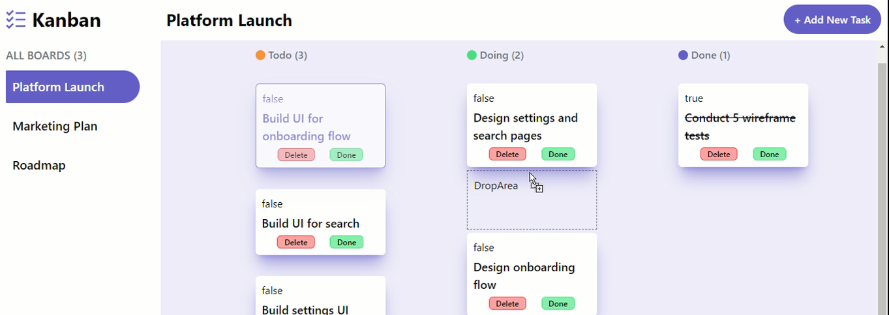

# Kanban Board Application

## Table of Contents

- [Overview](#overview)
- [Screen](#screen)
- [Features](#features)
- [Getting Started](#getting-started)
  - [Prerequisites](#prerequisites)
  - [Installation](#installation)
- [Usage](#usage)
- [Folder Structure](#folder-structure)
- [Components](#components)
- [Context](#context)
- [Styling](#styling)
- [Contributing](#contributing)
- [License](#license)

## Overview

This is a Kanban board application built with React. It allows users to manage tasks across different boards and columns (Todo, Doing, Done). Users can add, delete, and complete tasks, as well as switch between light and dark modes.

## Screen




## Features

- Add, delete, and complete tasks.
- Switch between different task boards (Platform Launch, Marketing Plan, Roadmap).
- Drag and drop tasks between columns.
- Light and dark mode toggles.
- Responsive design.

## Getting Started

### Prerequisites

- Node.js (v14 or higher)
- npm (v6 or higher) or yarn (v1.22 or higher)

### Installation

1. Clone the repository:
   ```bash
   git clone https://github.com/0uali-Yassine/kanban-Task-Management-app.git
   cd kanban-Task-Management-app

2. Install dependencies:
    ```bash
    npm install

3. Set up environment variables:
    -Create a .env file in the root directory.
    -Add your Spoonacular API key to the .env file
    ```bash
    REACT_APP_FIREBASE_API_KEY=your_api_key
    REACT_APP_FIREBASE_AUTH_DOMAIN=your_auth_domain
    REACT_APP_FIREBASE_PROJECT_ID=your_project_id
    REACT_APP_FIREBASE_STORAGE_BUCKET=your_storage_bucket
    REACT_APP_FIREBASE_MESSAGING_SENDER_ID=your_messaging_sender_id
    REACT_APP_FIREBASE_APP_ID=your_app_id

4. Start the development server:
    ```bash
    npm start

5. Open your browser and visit http://localhost:3000 to view the kanban-board.

## Usage
- The main view consists of a navigation bar, sidebar, and main content area where tasks are displayed.
- Use the sidebar to switch between different boards.
- Click the "+ Add New Task" button to open the task creation form.
- Use the drag-and-drop functionality to move tasks between columns.
- Toggle between light and dark modes using the switch in the sidebar.

## Folder Structure
```
├── public
│   ├── index.html
│   └── ...
├── src
│   ├── components
│   │   ├── Main.js
│   │   ├── Menu.js
│   │   ├── SideBar.js
│   │   ├── TaskCard.js
│   │   ├── TaskColumn.js
│   │   ├── TaskForm.js
│   │   └── DropArea.js
│   ├── Context.js
│   ├── App.js
│   ├── index.css
│   └── index.js
└── package.json
```

# Components

### `App.js`

The main component that renders the entire application. It includes the navigation bar, sidebar, and main content area.

### `Context.js`

Provides global state management using React's Context API. It includes states and functions for managing tasks, boards, and UI preferences (like dark mode).

### `components/TaskForm.js`

A form component for adding new tasks.

### `components/SideBar.js`

A sidebar component for navigating between different task boards and toggling the dark mode.

### `components/Main.js`

The main content area that displays tasks in columns based on their status.

### `components/TaskCard.js`

A card component that represents an individual task.

### `components/TaskColumn.js`

A column component that holds and displays tasks of a specific status (Todo, Doing, Done).

### `components/Menu.js`

A menu component that provides additional options and settings.

### `components/DropArea.js`

A drop area component that handles the drag-and-drop functionality for tasks.

## Styling

The application uses Tailwind CSS for styling. Custom styles are defined in the index.css file.

## Contributing

Contributions are welcome! Please fork the repository and create a pull request with your changes.

## License

Copy this content into a `README.md` file in your project's root directory. This file provides an overview, installation instructions, usage guidelines, and a description of the project structure and components.
